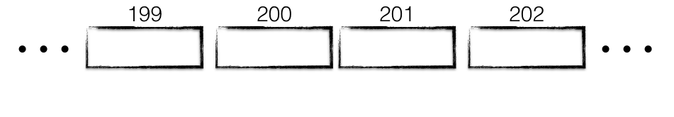
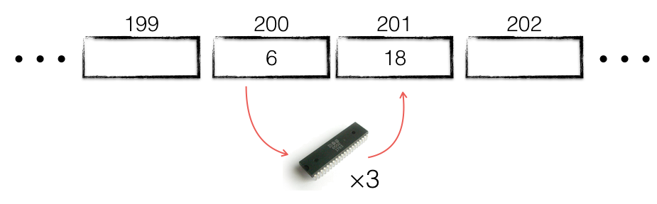
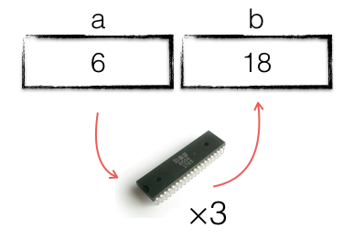

## What is memory?

Computer memory, RAM, can be thought of as a sequence of boxes, placed one after another in a line. Each box, or cell, is labeled with a unique number, which increments sequentially; this is the `address` of the cell, its `memory location`.



Each cell holds a single value. If you know the memory address of a cell, you can go to that cell and read its contents. You can place a value in that cell; replacing anything that was in there previously.

That’s all there is to know about memory. Everything the CPU does is expressed as fetching and depositing values into memory cells.

## What is a variable?

To write a program that retrieves the value stored in memory location 200, multiples it by 3 and deposits the result into memory location 201, we could write something like this in pseudocode:

- retrieve the value stored in address 200 and place it in the CPU.
- multiple the value stored in the CPU by 3.
- deposit the value stored in the CPU into memory location 201.



This is exactly how early programs were written; programmers would keep a list of memory locations, who used it, when, and what the value stored there represented.

Obviously this was tedious and error prone, and meant every possible value stored in memory had to be assigned an address during the construction of the program. Worse, this arrangement made it difficult to allocate storage to variables dynamically as the program ran– just imagine if you had to write large programs using only global variables.

To address this, the notion of a variable was created. A variable is just a convenient, alphanumeric pseudonym for a memory location; a label, or nickname.

Now, rather than talking about memory locations, we can talk about variables, which are convenient names we give to memory locations. The previous program can now be expressed as:


- Retrieve the value stored in variable a and place it in the CPU.
- multiple it by 3
- deposit the value into the variable b.



This is the same program, with one crucial improvement–because we no longer need to talk about memory locations directly, we no longer need to keep track of them–that drudgery is left to the compiler.

Now we can write a program like

```go
var a = 6
var b = a * 3
```

And the compiler will make sure that the variables a and b are assigned unique memory locations to hold their value for as long as needed.


# Credits:

- [Understand Go pointers in less than 800 words or your money back](https://dave.cheney.net/2017/04/26/understand-go-pointers-in-less-than-800-words-or-your-money-back) by [Dave Cheney](https://dave.cheney.net)