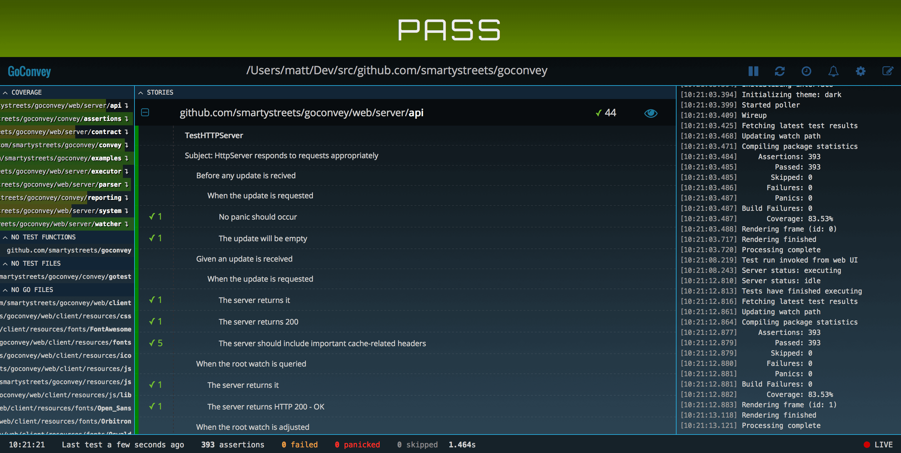

## Hướng dẫn sử dụng command line

### Bắt đầu với command line

Bạn nên gõ `go test -h` để biết chúng có những gì. Tuy đọc hơi mệt, nhưng cái này là chính xác nhất mô tả những gì mà câu lệnh `go test` có.

```go
$ go test -h
```

> Bạn nên nhớ: `testing` của Go bao gồm Unit Testing và Benchmark, từ đó bạn có thể tham khảo thêm các vấn đề có liên quan.

### Test toàn bộ folder

```bash
$ go test./...
```

### Show ra chi tiết

```bash
$ go test./... -v
```

> `-v` là viết tắt của từ verbose, thường được dùng cho hầu hết các phần mềm  ở dạng command line.

### Câu lệnh chi tiết hữu ích

```go
$ cd week1-exercise
$ go test -v -cover -run ^TestFind1$ ./...
```

**Output**

```bash
?   	_/home/phutp/noodle/golang-trainning/week1-exercise	[no test files]
=== RUN   TestFind1
--- PASS: TestFind1 (0.00s)
PASS
coverage: 9.1% of statements
ok  	_/home/phutp/noodle/golang-trainning/week1-exercise/helper	0.002s	coverage: 9.1% of statements
```

> Chú ý: Hểu về code coverage như thế nào lại là một item khác. Sẽ được bàn sau.

**Giải thích thêm:**

- `-cover` là show thông số về coverage của cái test, phần trăm càng cao càng tốt.
- `-run` là phải viết dạng regular expression: `^` là dành cho ký tự bắt dầu, `$` là kýt tự kết thúc.
- `./...` test toàn bộ folder


## Hướng dẫn sử dụng tool

### GoConvey

- Ưu điểm: Rất dễ sử dụng, và giao diện thân thiện, có tính năng watch và play/refresh
- Nhược điểm: Không thấy test lại chỉ một tính năng. Tuy nhiên điều này là không cần thiết và cũng không đúng về tư duy.

#### Get started

```go
$ go get github.com/smartystreets/goconvey
$ $GOPATH/bin/goconvey
```




## Các thư viện hỗ trợ viết Unit Test

1. [testify](https://github.com/stretchr/testify) |  Macher/Asserting library | Github Star: 7k
2. [ginkgo](https://github.com/onsi/ginkgo) |  BDD framework | Github Star: <3k
3. [gauge](https://gauge.org/) | Light weight cross-platform test automation tool | Github Star: 1584
4. [goblin](https://github.com/franela/goblin) | Minimal and Beautiful Go testing framework | Github Star: 600