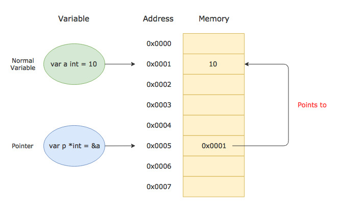

**A pointer is a variable that stores the memory address of another variable.**

> /!\ Before read this, you can visit another post to know more detail about [`What is memory?`](0x02.-Memory-and-Variable) and [`What is a variable?`](0x02.-Memory-and-Variable)

**Let’s break this down.**

Let’s first understand what a variable is. Well, Whenever we write any program, we need to store some data/information in memory. The data is stored in memory at a particular address. The memory addresses look something like `0xAFFFF` (That’s a hexadecimal representation of a memory address).

Now, To access the data, we need to know the address where it is stored. We can keep track of all the memory addresses where the data related to our program is stored. But imagine how hard it would be to remember all those memory addresses and access data using them.

That is why we have the concept of variables. A variable is just a convenient name given to a memory location where the data is stored.

A pointer is also a variable. But it’s a special kind of variable because the data that it stores is not just any normal value like a simple integer or a string, it’s a memory address of another variable



In the above example, the pointer p contains the value 0x0001 which is the address of the variable a.

## Declaring a Pointer

A pointer of type T is declared using the following syntax

```go
// A pointer of type T
var p *T
```

The type T is the type of the variable that the pointer points to. For example, following is a pointer of type `int`

```go
// A pointer of type int
var p *int
```

The above pointer can only store the memory address of int variables.

The `zero value` of a pointer is nil. That means any uninitialized pointer will have the value nil. Let’s see a complete example.

```go
package main
import "fmt"

func main() {
	var p *int
	fmt.Println("p = ", p)
}
```

```bash
# Output
p =  <nil>
```

## Initializing a Pointer

You can initialize a pointer with the memory address of another variable. The address of a variable can be retrieved using the `&` operator

```go
var x = 100
var p *int = &x
```

Notice how we use the `&` operator with the variable `x` to get its address, and then assign the address to the pointer `p`.

Just like any other variable in Golang, the type of a pointer variable is also inferred by the compiler. So you can omit the type declaration from the pointer `p` in the above example and write it like so:

```go
var p = &a
```

Let’s see a complete example to make things more clear

```go
package main
import "fmt"

func main() {
	var a = 5.67
	var p = &a

	fmt.Println("Value stored in variable a = ", a)
	fmt.Println("Address of variable a = ", &a)
	fmt.Println("Value stored in variable p = ", p)
}
```

```bash
# Output
Value stored in variable a =  5.67
Address of variable a =  0xc4200120a8
Value stored in variable p =  0xc4200120a8
```

## Dereferencing a Pointer

You can use the `*` operator on a pointer to access the value stored in the variable that the pointer points to. This is called `dereferencing` or `indirecting`

```go
package main
import "fmt"

func main() {
	var a = 100
	var p = &a

	fmt.Println("a = ", a)
	fmt.Println("p = ", p)
	fmt.Println("*p = ", *p)
}
```

```bash
# Output
a =  100
p =  0xc4200120a8
*p =  100
```

You can not only access the value of the pointed variable using `*` operator, but you can change it as well. The following example sets the value stored in the variable `a` through the pointer `p`

```go
package main
import "fmt"

func main() {
	var a = 1000
	var p = &a

	fmt.Println("a (before) = ", a)

	// Changing the value stored in the pointed variable through the pointer
	*p = 2000

	fmt.Println("a (after) = ", a)
}
```

```bash
# Output
a (before) =  1000
a (after) =  2000
```

## Creating a Pointer using the built-in new() function

You can also create a pointer using the built-in new() function. The new() function takes a type as an argument, allocates enough memory to accommodate a value of that type, and returns a pointer to it.

Here is an example:

```go
package main

import "fmt"

func main() {
	ptr := new(int) // Pointer to an `int` type
	*ptr = 100

	fmt.Printf("Ptr = %#x, Ptr value = %d\n", ptr, *ptr)
}
```

```bash
# Output
Ptr = 0xc420014058, Ptr value = 100
```

## Pointer to Pointer

A pointer can point to a variable of any type. It can point to another pointer as well. The following example shows how to create a pointer to another pointer

```go
package main
import "fmt"

func main() {
	var a = 7.98
	var p = &a
	var pp = &p

	fmt.Println("a = ", a)
	fmt.Println("address of a = ", &a)

	fmt.Println("p = ", p)
	fmt.Println("address of p = ", &p)

	fmt.Println("pp = ", pp)

	// Dereferencing a pointer to pointer
	fmt.Println("*pp = ", *pp)
	fmt.Println("**pp = ", **pp)
}
```

```bash
# Output
a =  7.98
address of a =  0xc4200120a8
p =  0xc4200120a8
address of p =  0xc42000c028
pp =  0xc42000c028
*pp =  0xc4200120a8
**pp =  7.98
```

## Credits:
- [Playing with Pointers in Golang](https://www.callicoder.com/golang-pointers/) by [Rajeev Kumar Singh](https://www.callicoder.com/about/)