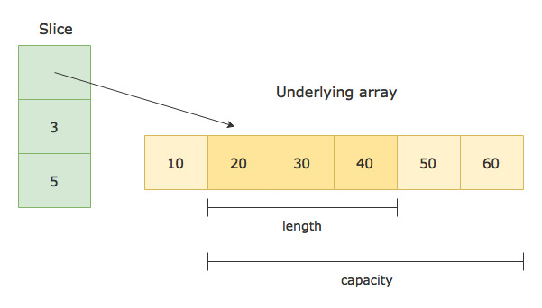

- [Working with Arrays](#working-with-arrays)
  - [Declaring an Array](#declaring-an-array)
  - [Accessing array elements by their index](#accessing-array-elements-by-their-index)
  - [Initializing an array using an array literal](#initializing-an-array-using-an-array-literal)
  - [Letting Go compiler infer the length of the array](#letting-go-compiler-infer-the-length-of-the-array)
  - [Exploring more about Golang arrays](#exploring-more-about-golang-arrays)
    - [1. Array’s length is part of its type](#1-arrays-length-is-part-of-its-type)
    - [3. Arrays in Golang are value types](#3-arrays-in-golang-are-value-types)
  - [Iterating over an array in Golang](#iterating-over-an-array-in-golang)
  - [Iterating over an array using range](#iterating-over-an-array-using-range)
  - [Multidimensional arrays in Golang](#multidimensional-arrays-in-golang)
- [Working with Slices](#working-with-slices)
  - [Declaring a Slice](#declaring-a-slice)
  - [Creating and Initializing a Slice](#creating-and-initializing-a-slice)
    - [1. Creating a slice using a slice literal](#1-creating-a-slice-using-a-slice-literal)
    - [2. Creating a slice from an array](#2-creating-a-slice-from-an-array)
    - [3. Creating a slice from another slice](#3-creating-a-slice-from-another-slice)
  - [Modifying a slice](#modifying-a-slice)
  - [Length and Capacity of a Slice](#length-and-capacity-of-a-slice)
  - [Creating a slice using the built-in make() function](#creating-a-slice-using-the-built-in-make-function)
  - [Zero value of slices](#zero-value-of-slices)
  - [Slice Functions](#slice-functions)
    - [1. The copy() function: copying a slice](#1-the-copy-function-copying-a-slice)
    - [2. The append() function: appending to a slice](#2-the-append-function-appending-to-a-slice)
  - [Appending to a nil slice](#appending-to-a-nil-slice)
  - [Appending one slice to another](#appending-one-slice-to-another)
  - [Slice of slices](#slice-of-slices)
  - [Iterating over a slice](#iterating-over-a-slice)
    - [1. Iterating over a slice using `for` loop](#1-iterating-over-a-slice-using-for-loop)
    - [2. Iterating over a slice using the `range` form of `for` loop](#2-iterating-over-a-slice-using-the-range-form-of-for-loop)
- [Working with Maps](#working-with-maps)
  - [Declaring a map](#declaring-a-map)
  - [Initializing a map](#initializing-a-map)
    - [1. Initializing a map using the built-in `make()` function](#1-initializing-a-map-using-the-built-in-make-function)
    - [2. Initializing a map using a map literal](#2-initializing-a-map-using-a-map-literal)
  - [Adding items (key-value pairs) to a map](#adding-items-key-value-pairs-to-a-map)
  - [Retrieving the value associated with a given key in a map](#retrieving-the-value-associated-with-a-given-key-in-a-map)
  - [Checking if a key exists in a map](#checking-if-a-key-exists-in-a-map)
  - [Deleting a key from a map](#deleting-a-key-from-a-map)
  - [Maps are reference types](#maps-are-reference-types)
  - [Iterating over a map](#iterating-over-a-map)
- [Credits](#credits)

# Working with Arrays

An array is a fixed-size collection of elements of the same type. The elements of the array are stored sequentially and can be accessed using their `index`.


## Declaring an Array

You can declare an array of length n and type T like so

```go
var a[n]T
```

For example, here is how you can declare an array of 10 integers

```go
// An array of 10 integers
var a[10]int
```

Now let’s see a complete example

```go
package main
import "fmt"

func main() {
	var x [5]int // An array of 5 integers
	fmt.Println(x)

	var y [8]string // An array of 8 strings
	fmt.Println(y)

	var z [3]complex128 // An array of 3 complex numbers
	fmt.Println(z)
}
```

```bash
# Output
[0 0 0 0 0]
[       ]
[(0+0i) (0+0i) (0+0i)]
```

By default, all the array elements are initialized with the zero value of the corresponding array type.

For example, if we declare an integer array, all the elements will be initialized with 0. If we declare a string array, all the elements will be initialized with an empty string "", and so on.

## Accessing array elements by their index

The elements of an array are stored sequentially and can be accessed by their `index`. The index starts from zero and ends at `length - 1`.

```go
package main
import "fmt"

func main() {
	var x [5]int // An array of 5 integers

	x[0] = 100
	x[1] = 101
	x[3] = 103
	x[4] = 105

	fmt.Printf("x[0] = %d, x[1] = %d, x[2] = %d\n", x[0], x[1], x[2])
	fmt.Println("x = ", x)
}
```

```bash
# Output
x[0] = 100, x[1] = 101, x[2] = 0
x =  [100 101 0 103 105]
```

In the above example, Since we didn’t assign any value to `x[2]`, it has the value `0` (The zero value for integers).

## Initializing an array using an array literal

You can declare and initialize an array at the same time like this

```go
// Declaring and initializing an array at the same time
var a = [5]int{2, 4, 6, 8, 10}
```

The expression on the right-hand side of the above statement is called an array literal.

Note that we do not need to specify the type of the variable `a` as in `var a [5]int`, because the compiler can automatically infer the type from the expression on the right hand side.

You can also use Golang’s short variable declaration for declaring and initializing an array. The above array declaration can also be written as below inside any function

```go
// Short hand declaration
a := [5]int{2, 4, 6, 8, 10}
```

Here is a complete example

```go
package main
import "fmt"

func main() {
	// Declaring and initializing an array at the same time
	var a = [5]int{2, 4, 6, 8, 10}
	fmt.Println(a)

	// Short declaration for declaring and initializing an array
	b := [5]int{2, 4, 6, 8, 10}
	fmt.Println(b)

	// You don't need to initialize all the elements of the array.
	// The un-initialized elements will be assigned the zero value of the corresponding array type
	c := [5]int{2}
	fmt.Println(c)
}
```

```bash
# Output
[2 4 6 8 10]
[2 4 6 8 10]
[2 0 0 0 0]
```

## Letting Go compiler infer the length of the array

You can also omit the size declaration from the initialization expression of the array, and let the compiler count the number of elements for you

```go
package main
import "fmt"

func main() {
	// Letting Go compiler infer the length of the array
	a := [...]int{3, 5, 7, 9, 11, 13, 17}
	fmt.Println(a)
}
```
```bash
# Output
[3 5 7 9 11 13 17]
```

## Exploring more about Golang arrays

### 1. Array’s length is part of its type

The length of an array is part of its type. So the array `a[5]int` and `a[10]int` are completely distinct types, and you cannot assign one to the other.

This also means that you cannot resize an array, because resizing an array would mean changing its type, and you cannot change the type of a variable in Golang.

This also means that you cannot resize an array, because resizing an array would mean changing its type, and you cannot change the type of a variable in Golang.

```go
package main

func main() {
  var a = [5]int{3, 5, 7, 9, 11}
  var b [10]int = a  // Error, a and b are distinct types 
}
```

### 3. Arrays in Golang are value types

Arrays in Golang are value types unlike other languages like C, C++, and Java where arrays are reference types.

This means that when you assign an array to a new variable or pass an array to a function, the entire array is copied. So if you make any changes to this copied array, the original array won’t be affected and will remain unchanged.

Here is an example

```go
package main
import "fmt"

func main() {
  a1 := [5]string{"English", "Japanese", "Spanish", "French", "Hindi"}
  a2 := a1 // A copy of the array `a1` is assigned to `a2`

  a2[1] = "German"

  fmt.Println("a1 = ", a1) // The array `a1` remains unchanged
  fmt.Println("a2 = ", a2)
}
```

```bash
# Output
a1 =  [English Japanese Spanish French Hindi]
a2 =  [English German Spanish French Hindi]
```

## Iterating over an array in Golang

You can use the for loop to iterate over an array like so 

```go
package main
import "fmt"

func main() {
	names := [3]string{"Mark Zuckerberg", "Bill Gates", "Larry Page"}

	for i := 0; i < len(names); i++ {
		fmt.Println(names[i])
	}
}
```

```bash
# Output
Mark Zuckerberg
Bill Gates
Larry Page
```

The `len()` function in the above example is used to find the length of the array.

Let’s see another example. In the example below, we find the sum of all the elements of the array by iterating over the array, and adding the elements one by one to the variable `sum`

```go
package main
import "fmt"

func main() {
	a := [4]float64{3.5, 7.2, 4.8, 9.5}
	sum := float64(0)

	for i := 0; i < len(a); i++ {
		sum = sum + a[i]
	}

	fmt.Printf("Sum of all the elements in array  %v = %f\n", a, sum)
}
```

```bash
# Output
Sum of all the elements in array  [3.5 7.2 4.8 9.5] = 25.000000
```

## Iterating over an array using range

Golang provides a more powerful form of `for` loop using the `range` operator. Here is how you can use the `range` operator with `for` loop to iterate over an array

```go
package main

import "fmt"

func main() {
	daysOfWeek := [7]string{"Mon", "Tue", "Wed", "Thu", "Fri", "Sat", "Sun"}

	for index, value := range daysOfWeek {
		fmt.Printf("Day %d of week = %s\n", index, value)
	}
}
```

```bash
# Output
Day 0 of week = Mon
Day 1 of week = Tue
Day 2 of week = Wed
Day 3 of week = Thu
Day 4 of week = Fri
Day 5 of week = Sat
Day 6 of week = Sun
```

Let’s now write the same `sum` example that we wrote with normal `for` loop using `range` form of the `for` loop

```go
package main
import "fmt"

func main() {
	a := [4]float64{3.5, 7.2, 4.8, 9.5}
	sum := float64(0)

	for index, value := range a {
		sum = sum + value
	}

	fmt.Printf("Sum of all the elements in array %v = %f", a, sum)
}
```

When you run the above program, it’ll generate an error like this

```bash
# Output
./array_iteration_range.go:9:13: index declared and not used
```

Go compiler doesn’t allow creating variables that are never used. You can fix this by using an `_` (underscore) in place of `index`

```go
package main
import "fmt"

func main() {
	a := [4]float64{3.5, 7.2, 4.8, 9.5}
	sum := float64(0)

	for _, value := range a {
		sum = sum + value
	}

	fmt.Printf("Sum of all the elements in array %v = %f", a, sum)
}
```

The underscore (`_`) is used to tell the compiler that we don’t need this variable. The above program now runs successfully and outputs the sum of the array

```bash
# Output
Sum of all the elements in array [3.5 7.2 4.8 9.5] = 25.000000
```

## Multidimensional arrays in Golang

All the arrays that we created so far in this post are one dimensional. You can also create multi-dimensional arrays in Golang.

The following example demonstrates how to create multidimensional arrays

```go
package main

import "fmt"

func main() {
	a := [2][2]int{
		{3, 5},
		{7, 9},	// This trailing comma is mandatory
	}
	fmt.Println(a)

	// Just like 1D arrays, you don't need to initialize all the elements in a multi-dimensional array.
	// Un-initialized array elements will be assigned the zero value of the array type.
	b := [3][4]float64{
		{1, 3},
		{4.5, -3, 7.4, 2},
		{6, 2, 11},
	}
	fmt.Println(b)
}
```

```bash
# Output
[[3 5] [7 9]]
[[1 3 0 0] [4.5 -3 7.4 2] [6 2 11 0]]
```

# Working with Slices

A Slice is a segment of an array. Slices build on arrays and provide more power, flexibility, and convenience compared to arrays.

Just like arrays, Slices are indexable and have a length. But unlike arrays, they can be resized.

Internally, A Slice is just a reference to an underlying array. In this article, we’ll learn how to create and use slices, and also understand how they work under the hood.

## Declaring a Slice

A slice of type `T` is declared using `[]T`. For example, Here is how you can declare a slice of type `int`

```go
// Slice of type `int`
var s []int
```

The slice is declared just like an array except that we do not specify any size in the brackets `[]`.

## Creating and Initializing a Slice

### 1. Creating a slice using a slice literal

You can create a slice using a slice literal like this

```go
// Creating a slice using a slice literal
var s = []int{3, 5, 7, 9, 11, 13, 17}
```

The expression on the right-hand side of the above statement is a **slice literal**. The slice literal is declared just like an array literal, except that you do not specify any size in the square brackets `[]`.

When you create a slice using a slice literal, it first creates an array and then returns a slice reference to it.

Let’s see a complete example

```go
package main
import "fmt"

func main() {
	// Creating a slice using a slice literal
	var s = []int{3, 5, 7, 9, 11, 13, 17}

	// Short hand declaration
	t := []int{2, 4, 8, 16, 32, 64}

	fmt.Println("s = ", s)
	fmt.Println("t = ", t)
}
```

```bash
# Output
s =  [3 5 7 9 11 13 17]
t =  [2 4 8 16 32 64]
```

### 2. Creating a slice from an array

Since a slice is a segment of an array, we can create a slice from an array.

To create a slice from an array a, we specify two indices low (lower bound) and high (upper bound) separated by a colon

```go
// Obtaining a slice from an array `a`
a[low:high]
```

The above expression selects `a` slice from the array `a`. The resulting slice includes all the elements starting from index `low` to `high`, but excluding the element at index `high`.

Let’s see an example to make things more clear

```go
package main
import "fmt"

func main() {
	var a = [5]string{"Alpha", "Beta", "Gamma", "Delta", "Epsilon"}

	// Creating a slice from the array
	var s []string = a[1:4]

	fmt.Println("Array a = ", a)
	fmt.Println("Slice s = ", s)
}
```

```bash
# Output
Array a =  [Alpha Beta Gamma Delta Epsilon]
Slice s =  [Beta Gamma Delta]
```

The `low` and `high` indices in the slice expression are optional. The default value for `low` is `0`, and `high` is the length of the slice.

```go
package main
import "fmt"

func main() {
	a := [5]string{"C", "C++", "Java", "Python", "Go"}

	slice1 := a[1:4]
	slice2 := a[:3]
	slice3 := a[2:]
	slice4 := a[:]

	fmt.Println("Array a = ", a)
	fmt.Println("slice1 = ", slice1)
	fmt.Println("slice2 = ", slice2)
	fmt.Println("slice3 = ", slice3)
	fmt.Println("slice4 = ", slice4)
}
```

```bash
# Output
Array a =  [C C++ Java Python Go]
slice1 =  [C++ Java Python]
slice2 =  [C C++ Java]
slice3 =  [Java Python Go]
slice4 =  [C C++ Java Python Go]
```

### 3. Creating a slice from another slice

A slice can also be created by slicing an existing slice.

```go
package main
import "fmt"

func main() {
	cities := []string{"New York", "London", "Chicago", "Beijing", "Delhi", "Mumbai", "Bangalore", "Hyderabad", "Hong Kong"}

	asianCities := cities[3:]
	indianCities := asianCities[1:5]

	fmt.Println("cities = ", cities)
	fmt.Println("asianCities = ", asianCities)
	fmt.Println("indianCities = ", indianCities)
}
```

```bash
# Output
cities =  [New York London Chicago Beijing Delhi Mumbai Bangalore Hyderabad Hong Kong]
asianCities =  [Beijing Delhi Mumbai Bangalore Hyderabad Hong Kong]
indianCities =  [Delhi Mumbai Bangalore Hyderabad]
```

## Modifying a slice

Slices are reference types. They refer to an underlying array. Modifying the elements of a slice will modify the corresponding elements in the referenced array. Other slices that refer the same array will also see those modifications.

```go
package main
import "fmt"

func main() {
	a := [7]string{"Mon", "Tue", "Wed", "Thu", "Fri", "Sat", "Sun"}

	slice1 := a[1:]
	slice2 := a[3:]

	fmt.Println("------- Before Modifications -------")
	fmt.Println("a  = ", a)
	fmt.Println("slice1 = ", slice1)
	fmt.Println("slice2 = ", slice2)

	slice1[0] = "TUE"
	slice1[1] = "WED"
	slice1[2] = "THU"

	slice2[1] = "FRIDAY"

	fmt.Println("\n-------- After Modifications --------")
	fmt.Println("a  = ", a)
	fmt.Println("slice1 = ", slice1)
	fmt.Println("slice2 = ", slice2)
}
```

```bash
# Output
------- Before Modifications -------
a  =  [Mon Tue Wed Thu Fri Sat Sun]
slice1 =  [Tue Wed Thu Fri Sat Sun]
slice2 =  [Thu Fri Sat Sun]

-------- After Modifications --------
a  =  [Mon TUE WED THU FRIDAY Sat Sun]
slice1 =  [TUE WED THU FRIDAY Sat Sun]
slice2 =  [THU FRIDAY Sat Sun]
```

## Length and Capacity of a Slice

A slice consists of three things:

  - A **pointer** (reference) to an underlying array.
  - The **length** of the segment of the array that the slice contains.
- The **capacity** (the maximum size up to which the segment can grow).


Let’s consider the following array and the slice obtained from it as an example:

```go
var a = [6]int{10, 20, 30, 40, 50, 60}
var s = [1:4]
```

Here is how the slice s in the above example is represented:



The length of the slice is the number of elements in the slice, which is `3` in the above example.

The capacity is the number of elements in the underlying array starting from the first element in the slice. It is `5` in the above example.

You can find the length and capacity of a slice using the built-in functions `len()` and `cap()`

```go
package main
import "fmt"

func main() {
	a := [6]int{10, 20, 30, 40, 50, 60}
	s := a[1:4]

	fmt.Printf("s = %v, len = %d, cap = %d\n", s, len(s), cap(s))
}
```

```bash
# Output
s = [20 30 40], len = 3, cap = 5
```

A slice’s length can be extended up to its capacity by re-slicing it. Any attempt to extend its length beyond the available capacity will result in a runtime error.

Check out the following example to understand how re-slicing a given slice changes its length and capacity:

```go
package main
import "fmt"

func main() {
	s := []int{10, 20, 30, 40, 50, 60, 70, 80, 90, 100}
	fmt.Println("Original Slice")
	fmt.Printf("s = %v, len = %d, cap = %d\n", s, len(s), cap(s))

	s = s[1:5]
	fmt.Println("\nAfter slicing from index 1 to 5")
	fmt.Printf("s = %v, len = %d, cap = %d\n", s, len(s), cap(s))

	s = s[:8]
	fmt.Println("\nAfter extending the length")
	fmt.Printf("s = %v, len = %d, cap = %d\n", s, len(s), cap(s))

	s = s[2:]
	fmt.Println("\nAfter dropping the first two elements")
	fmt.Printf("s = %v, len = %d, cap = %d\n", s, len(s), cap(s))
}
```

```bash
# Output
Original Slice
s = [10 20 30 40 50 60 70 80 90 100], len = 10, cap = 10

After slicing from index 1 to 5
s = [20 30 40 50], len = 4, cap = 9

After extending the length
s = [20 30 40 50 60 70 80 90], len = 8, cap = 9

After dropping the first two elements
s = [40 50 60 70 80 90], len = 6, cap = 7
```

## Creating a slice using the built-in make() function

Now that we know about the length and capacity of a slice. Let’s look at another way to create a slice.

Golang provides a library function called `make()` for creating slices. Following is the signature of `make()` function:

```go
func make([]T, len, cap) []T
```

The make function takes a type, a length, and an optional capacity. It allocates an underlying array with size equal to the given capacity, and returns a slice that refers to that array.

```go
package main
import "fmt"

func main() {
	// Creates an array of size 10, slices it till index 5, and returns the slice reference
	s := make([]int, 5, 10)
	fmt.Printf("s = %v, len = %d, cap = %d\n", s, len(s), cap(s))
}
```

```bash
# Output
s = [0 0 0 0 0], len = 5, cap = 10
```

The capacity parameter in the `make()` function is optional. When omitted, it defaults to the specified length:

```go
package main
import "fmt"

func main() {
	// Creates an array of size 5, and returns a slice reference to it
	s := make([]int, 5)
	fmt.Printf("s = %v, len = %d, cap = %d\n", s, len(s), cap(s))
}
```

```bash
# Output
s = [0 0 0 0 0], len = 5, cap = 5
```

## Zero value of slices

The zero value of a slice is nil. A nil slice doesn’t have any underlying array, and has a length and capacity of 0:

```go
package main
import "fmt"

func main() {
	var s []int
	fmt.Printf("s = %v, len = %d, cap = %d\n", s, len(s), cap(s))

	if s == nil {
		fmt.Println("s is nil")
	}
}
```

```bash
# Output
s = [], len = 0, cap = 0
s is nil
```

## Slice Functions

### 1. The copy() function: copying a slice

The `copy()` function copies elements from one slice to another. Its signature looks like this -

```go
func copy(dst, src []T) int
```

It takes two slices - a destination slice, and a source slice. It then copies elements from the source to the destination and returns the number of elements that are copied.

Note that the elements are copied only if the destination slice has sufficient capacity.

```go
package main
import "fmt"

func main() {
	src := []string{"Sublime", "VSCode", "IntelliJ", "Eclipse"}
	dest := make([]string, 2)

	numElementsCopied := copy(dest, src)

	fmt.Println("src = ", src)
	fmt.Println("dest = ", dest)
	fmt.Println("Number of elements copied from src to dest = ", numElementsCopied)
}
```

```bash
# Output
src =  [Sublime VSCode IntelliJ Eclipse]
dest =  [Sublime VSCode]
Number of elements copied from src to dest =  2
```

### 2. The append() function: appending to a slice

The `append()` function appends new elements at the end of a given slice. Following is the signature of append function.

```go
func append(s []T, x ...T) []T
```

It takes a slice and a variable number of arguments **x …T**. It then returns a new slice containing all the elements from the given slice as well as the new elements.

If the given slice doesn’t have sufficient capacity to accommodate new elements then a new underlying array is allocated with bigger capacity. All the elements from the underlying array of the existing slice are copied to this new array, and then the new elements are appended.

However, if the slice has enough capacity to accommodate new elements, then the `append()` function re-uses its underlying array and appends new elements to the same array.

Let’s see an example to understand things better:

```go
package main
import "fmt"

func main() {
	slice1 := []string{"C", "C++", "Java"}
	slice2 := append(slice1, "Python", "Ruby", "Go")

	fmt.Printf("slice1 = %v, len = %d, cap = %d\n", slice1, len(slice1), cap(slice1))
	fmt.Printf("slice2 = %v, len = %d, cap = %d\n", slice2, len(slice2), cap(slice2))

	slice1[0] = "C#"
	fmt.Println("\nslice1 = ", slice1)
	fmt.Println("slice2 = ", slice2)
}
```

```bash
# Output
slice1 = [C C++ Java], len = 3, cap = 3
slice2 = [C C++ Java Python Ruby Go], len = 6, cap = 6

slice1 =  [C# C++ Java]
slice2 =  [C C++ Java Python Ruby Go]
```

In the above example, since `slice1` has capacity 3, it can’t accommodate more elements. So a new underlying array is allocated with bigger capacity when we append more elements to it.

So if you modify `slice1`, `slice2` won’t see those changes because it refers to a different array.

**But what if `slice1` had enough capacity to accommodate new elements**? Well, in that case, no new array would be allocated, and the elements would be added to the same underlying array.

Also, in that case, changes to `slice1` would affect `slice2` as well because both would refer to the same underlying array. This is demonstrated in the following example:

```go
package main
import "fmt"

func main() {
	slice1 := make([]string, 3, 10)
	copy(slice1, []string{"C", "C++", "Java"})

	slice2 := append(slice1, "Python", "Ruby", "Go")

	fmt.Printf("slice1 = %v, len = %d, cap = %d\n", slice1, len(slice1), cap(slice1))
	fmt.Printf("slice2 = %v, len = %d, cap = %d\n", slice2, len(slice2), cap(slice2))

	slice1[0] = "C#"
	fmt.Println("\nslice1 = ", slice1)
	fmt.Println("slice2 = ", slice2)
}
```

```bash
# Output
slice1 = [C C++ Java], len = 3, cap = 10
slice2 = [C C++ Java Python Ruby Go], len = 6, cap = 10

slice1 =  [C# C++ Java]
slice2 =  [C# C++ Java Python Ruby Go]
```

## Appending to a nil slice

When you append values to a nil slice, it allocates a new slice and returns the reference of the new slice.

```go
package main
import "fmt"

func main() {
	var s []string

	// Appending to a nil slice
	s = append(s, "Cat", "Dog", "Lion", "Tiger")

	fmt.Printf("s = %v, len = %d, cap = %d\n", s, len(s), cap(s))
}
```

```bash
# Output
s = [Cat Dog Lion Tiger], len = 4, cap = 4
```

## Appending one slice to another

You can directly append one slice to another using the `...` operator. This operator expands the slice to a list of arguments. The following example demonstrates its usage:

```go
package main
import "fmt"

func main() {
	slice1 := []string{"Jack", "John", "Peter"}
	slice2 := []string{"Bill", "Mark", "Steve"}

	slice3 := append(slice1, slice2...)

	fmt.Println("slice1 = ", slice1)
	fmt.Println("slice2 = ", slice2)
	fmt.Println("After appending slice1 & slice2 = ", slice3)
}
```

```bash
# Output
slice1 =  [Jack John Peter]
slice2 =  [Bill Mark Steve]
After appending slice1 & slice2 =  [Jack John Peter Bill Mark Steve]
```

## Slice of slices

Slices can be of any type. They can also contain other slices. The example below creates a slice of slices -

```go
package main

import "fmt"

func main() {
	s := [][]string{
		{"India", "China"},
		{"USA", "Canada"},
		{"Switzerland", "Germany"},
	}

	fmt.Println("Slice s = ", s)
	fmt.Println("length = ", len(s))
	fmt.Println("capacity = ", cap(s))
}
```

```bash
# Output
Slice s =  [[India China] [USA Canada] [Switzerland Germany]]
length =  3
capacity =  3
```

## Iterating over a slice

You can iterate over a slice in the same way you iterate over an array. Following are two ways of iterating over a slice:

### 1. Iterating over a slice using `for` loop

```go
package main
import "fmt"

func main() {
	countries := []string{"India", "America", "Russia", "England"}

	for i := 0; i < len(countries); i++ {
		fmt.Println(countries[i])
	}
}
```

```bash
# Output
India
America
Russia
England
```

### 2. Iterating over a slice using the `range` form of `for` loop

```go
package main
import "fmt"

func main() {
	primeNumbers := []int{2, 3, 5, 7, 11, 13, 17, 19, 23, 29}

	for index, number := range primeNumbers {
		fmt.Printf("PrimeNumber(%d) = %d\n", index+1, number)
	}
}
```

```bash
# Output
PrimeNumber(1) = 2
PrimeNumber(2) = 3
PrimeNumber(3) = 5
PrimeNumber(4) = 7
PrimeNumber(5) = 11
PrimeNumber(6) = 13
PrimeNumber(7) = 17
PrimeNumber(8) = 19
PrimeNumber(9) = 23
PrimeNumber(10) = 29
```

**Ignoring the `index` from the `range` form of `for` loop using Blank identifier**

The `range` form of `for` loop gives you the `index` and the `value` at that index in each iteration. If you don’t want to use the `index`, then you can discard it by using an underscore `_`.

The underscore (`_`) is called the blank identifier. It is used to tell Go compiler that we don’t need this value.

```go
package main
import "fmt"

func main() {
	numbers := []float64{3.5, 7.4, 9.2, 5.4}

	sum := 0.0
	for _, number := range numbers {
		sum += number
	}

	fmt.Printf("Total Sum = %.2f\n", sum)
}
```

```bash
# Output
Total Sum = 25.50
```

# Working with Maps

A map is an unordered collection of key-value pairs. It maps keys to values. The keys are unique within a map while the values may not be.

The map data structure is used for fast lookups, retrieval, and deletion of data based on keys. It is one of the most used data structures in computer science.

Go provides a built-in map type. In this article, we’ll learn how to use Golang’s built-in map type.

## Declaring a map

A map is declared using the following syntax:

```go
var m map[KeyType]ValueType
```

For example, Here is how you can declare a map of `string` keys to `int` values:

var m map[string]int
The zero value of a map is `nil`. A `nil` map has no keys. Moreover, any attempt to add keys to a `nil` map will result in a runtime error.

Let’s see an example:

```go
package main
import "fmt"

func main() {
	var m map[string]int
	fmt.Println(m)
	if m == nil {
		fmt.Println("m is nil")
	}

	// Attempting to add keys to a nil map will result in a runtime error
	// m["one hundred"] = 100
}
```

```bash
# Output
map[]
m is nil
```

If you uncomment the statement `m["one hundred"] = 100`, the program will generate the following error:

```bash
panic: assignment to entry in nil map
```

It is, therefore, necessary to initialize a map before adding items to it.

## Initializing a map
### 1. Initializing a map using the built-in `make()` function

You can initialize a map using the built-in `make()` function. You just need to pass the type of the map to the `make()` function as in the example below. The function will return an initialized and ready to use map

```go
// Initializing a map using the built-in `make()` function
var m = make(map[string]int)
```

Let’s see a complete example:

```go
package main
import "fmt"

func main() {
	var m = make(map[string]int)

	fmt.Println(m)

	if m == nil {
		fmt.Println("m is nil")
	} else {
		fmt.Println("m is not nil")
	}

	// make() function returns an initialized and ready to use map.
	// Since it is initialized, you can add new keys to it.
	m["one hundred"] = 100
	fmt.Println(m)
}
```

```bash
# Output
map[]
m is not nil
map[one hundred:100]
```

### 2. Initializing a map using a map literal
A map literal is a very convenient way to initialize a map with some data. You just need to pass the key-value pairs separated by colon inside curly braces like this

```go
var m = map[string]int{
	"one": 1,
	"two": 2,
	"three": 3,
}
```

Note that the last trailing comma is necessary, otherwise, you’ll get a compiler error.

Let’s check out a complete example:

```go
package main
import "fmt"

func main() {
	var m = map[string]int{
		"one":   1,
		"two":   2,
		"three": 3,
		"four":  4,
		"five":  5, // Comma is necessary
	}

	fmt.Println(m)
}
```

```bash
# Output
map[one:1 two:2 three:3 four:4 five:5]
```

You can also create an empty map using a map literal by leaving the curly braces empty

```go
// Initialize an empty map
var m = map[string]int{}
```

The above statement is functionally identical to using the` make()` function.

## Adding items (key-value pairs) to a map

You can add new items to an initialized map using the following syntax

```go
m[key] = value
```

The following example initializes a map using the make() function and adds some new items to it

```go
package main
import "fmt"

func main() {
	// Initializing a map
	var tinderMatch = make(map[string]string)

	// Adding keys to a map
	tinderMatch["Rajeev"] = "Angelina" // Assigns the value "Angelina" to the key "Rajeev"
	tinderMatch["James"] = "Sophia"
	tinderMatch["David"] = "Emma"

	fmt.Println(tinderMatch)

	/*
	  Adding a key that already exists will simply override
	  the existing key with the new value
	*/
	tinderMatch["Rajeev"] = "Jennifer"
	fmt.Println(tinderMatch)
}
```

```
# Output
map[Rajeev:Angelina James:Sophia David:Emma]
map[Rajeev:Jennifer James:Sophia David:Emma]
```

If you try to add a key that already exists in the map, then it will simply be overridden by the new value.

## Retrieving the value associated with a given key in a map

You can retrieve the value assigned to a key in a map using the syntax `m[key]`. If the key exists in the map, you’ll get the assigned value. Otherwise, you’ll get the zero value of the map’s value type.

Let’s check out an example to understand this:

```go
package main
import "fmt"

func main() {
	var personMobileNo = map[string]string{
		"John":  "+33-8273658526",
		"Steve": "+1-8579822345",
		"David": "+44-9462834443",
	}

	var mobileNo = personMobileNo["Steve"]
	fmt.Println("Steve's Mobile No : ", mobileNo)

	// If a key doesn't exist in the map, we get the zero value of the value type
	mobileNo = personMobileNo["Jack"]
	fmt.Println("Jack's Mobile No : ", mobileNo)
}
```

```bash
# Output
Steve's Mobile No :  +1-8579822345
Jack's Mobile No : 
```

In the above example, since the key `"Jack"` doesn’t exist in the map, we get the zero value of the map’s value type. Since the map’s value type is `string`, we get `" "`.

*Unlike other languages, we do not get a runtime error in Golang if the key doesn’t exist in the map.*

**But what if you want to check for the existence of a key**? In the above example, the map would return `" "` even if the key `"Jack"` existed with the value `" "`. So how do we distinguish between cases where a key exists with the value equal to the zero value of the value type, and the absence of a key?

Well, let’s find out.

## Checking if a key exists in a map

When you retrieve the value assigned to a given key using the syntax `map[key]`, it returns an additional boolean value as well which is `true` if the key exists in the map, and `false` if it doesn’t exist.

So you can check for the existence of a key in a map by using the following two-value assignment:

```go
value, ok := m[key]
```

The boolean variable `ok` will be `true` if the key exists, and `false` otherwise.

Consider the following map for example. It maps employeeIds to names:

var employees = map[int]string{
	1001: "Rajeev",
	1002: "Sachin",
	1003: "James",
}
Accessing the key `1001` will return `"Rajeev"` and `true`, since the key `1001` exists in the map:

```go
name, ok := employees[1001]  // "Rajeev", true
```

However, If you try to access a key that doesn’t exist, then the map will return an empty string `""` (zero value of strings), and `false`.

```go
name, ok := employees[1010]  // "", false
```

If you just want to check for the existence of a key without retrieving the value associated with that key, then you can use an `_` (underscore) in place of the first value

```go
_, ok := employees[1005]
```

Now let’s check out a complete example:

```go
package main
import "fmt"

func main() {
	var employees = map[int]string{
		1001: "John",
		1002: "Steve",
		1003: "Maria",
	}

	printEmployee(employees, 1001)
	printEmployee(employees, 1010)

	if isEmployeeExists(employees, 1002) {
		fmt.Println("EmployeeId 1002 found")
	}
}

func printEmployee(employees map[int]string, employeeId int) {
	if name, ok := employees[employeeId]; ok {
		fmt.Printf("name = %s, ok = %v\n", name, ok)
	} else {
		fmt.Printf("EmployeeId %d not found\n", employeeId)
	}
}

func isEmployeeExists(employees map[int]string, employeeId int) bool {
	_, ok := employees[employeeId]
	return ok
}
```

```bash
# Output
name = Rajeev, ok = true
EmployeeId 1010 not found
EmployeeId 1002 found
```

In the above example, I’ve used a short declaration in the if statement to initialize the `name` and `ok` values, and then test the boolean value `ok`. It makes the code more concise.

## Deleting a key from a map

You can delete a key from a map using the built-in `delete()` function. The syntax looks like this

```go
// Delete the `key` from the `map`
delete(map, key)
```

The `delete()` function doesn’t return any value. Also, it doesn’t do anything if the key doesn’t exist in the map.

Here is a complete example:

```go
package main

import "fmt"

func main() {
	var fileExtensions = map[string]string{
		"Python": ".py",
		"C++":    ".cpp",
		"Java":   ".java",
		"Golang": ".go",
		"Kotlin": ".kt",
	}

	fmt.Println(fileExtensions)

	delete(fileExtensions, "Kotlin")

	// delete function doesn't do anything if the key doesn't exist
	delete(fileExtensions, "Javascript")

	fmt.Println(fileExtensions)
}
```

```bash
# Output
map[Python:.py C++:.cpp Java:.java Golang:.go Kotlin:.kt]
map[Python:.py C++:.cpp Java:.java Golang:.go]
```

## Maps are reference types


Maps are reference types. When you assign a map to a new variable, they both refer to the same underlying data structure. Therefore changes done by one variable will be visible to the other

```go
package main
import "fmt"

func main() {
	var m1 = map[string]int{
		"one":   1,
		"two":   2,
		"three": 3,
		"four":  4,
		"five":  5,
	}

	var m2 = m1
	fmt.Println("m1 = ", m1)
	fmt.Println("m2 = ", m2)

	m2["ten"] = 10
	fmt.Println("\nm1 = ", m1)
	fmt.Println("m2 = ", m2)
}
```

```bash
# Output
m1 =  map[one:1 two:2 three:3 four:4 five:5]
m2 =  map[one:1 two:2 three:3 four:4 five:5]

m1 =  map[one:1 two:2 three:3 four:4 five:5 ten:10]
m2 =  map[one:1 two:2 three:3 four:4 five:5 ten:10]
```

The same concept applies when you pass a map to a function. Any changes done to the map inside the function is also visible to the caller.

## Iterating over a map

You can iterate over a map using `range` form of the for loop. It gives you the key, value pair in every iteration

```go
package main
import "fmt"

func main() {
	var personAge = map[string]int{
		"Rajeev": 25,
		"James":  32,
		"Sarah":  29,
	}

	for name, age := range personAge {
		fmt.Println(name, age)
	}

}
```

```bash
# Output
James 32
Sarah 29
Rajeev 25
```

Note that, A map is an unordered collection and therefore the iteration order of a map is not guaranteed to be the same every time you iterate over it.

So if you run the above program multiple times, you’ll get the results in different orders.

# Credits

- [Working with Arrays in Golang](https://www.callicoder.com/golang-arrays/)
- [Introduction to Slices in Golang](https://www.callicoder.com/golang-slices/)
- [Golang Maps by Example](https://www.callicoder.com/golang-maps/)